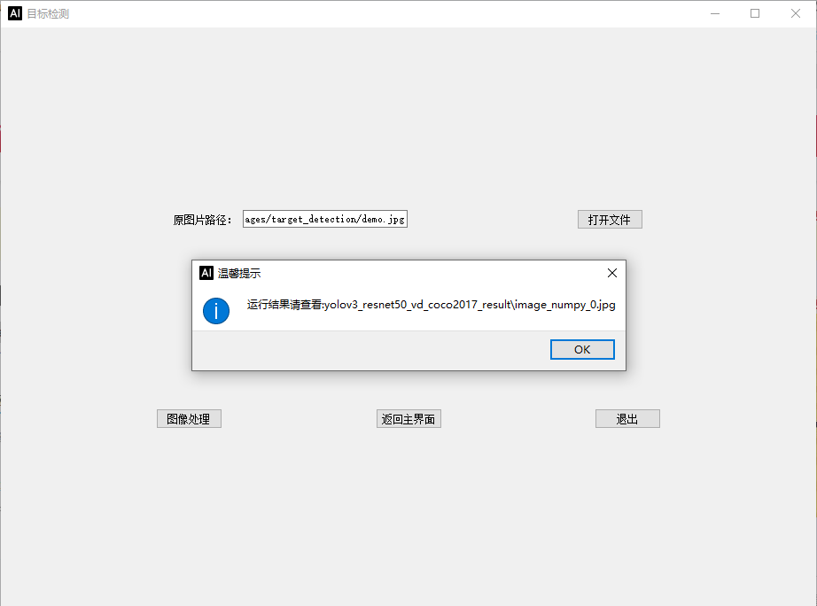
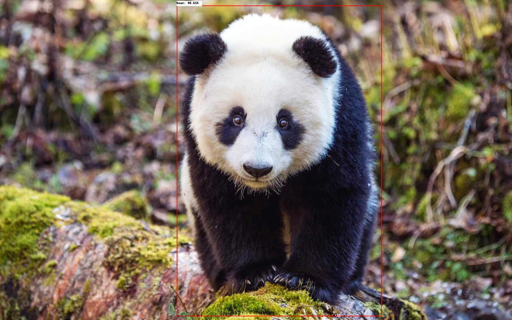
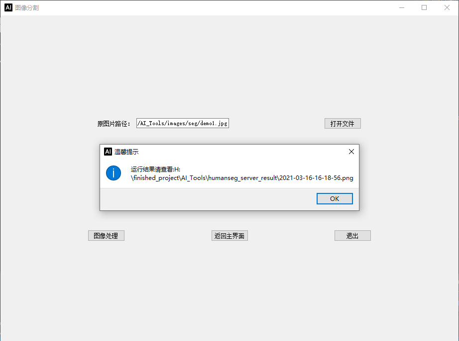

# [AI创造营]基于PaddleHub的智能工具箱AI Tools 
## 1.技术背景
使用<b>PaddleHub</b>和<b>PyQt5</b>技术开发的一个智能工具箱AI Tools,其中包括了<b>PaddleHub</b>中图像分类的<b>resnet50_vd_animals</b>模型, 文字识别的<b>chinese_ocr_db_crnn_server</b>模型, 目标检测的<b>yolov3_resnet50_vd_coco2017</b>模型, 图像生成的<b>stylepro_artistic</b>,<b>stgan_bald</b>模型, 人脸检测的<b>pyramidbox_lite_server_mask</b>模型, 图像编辑的<b>deoldify</b>模型, 图像分割的<b>humanseg_server</b>模型.

## 2.上手使用
tips:请在本地电脑上使用
### 第一步 配置环境 
pip install paddlepaddle
pip install paddlehub
pip install shapely
pip install pyclipper

### 第二步  启动Paddlehub Serving
```cmd
hub serving start --config config.json      // cpu版本
hub serving start --config gpuconfig.json   // gpu版本，但是没有测试
```
开启服务过程比较慢，请耐心等待！
由于自己电脑没有GPU，因此使用CPU版本进行测试，因此有几项功能比较慢,尤其是老照片上色功能，请大家耐心等待！

### 第三步 使用智能工具箱AI Tools
``` cmd
python main.py
```

主页：


动物分类resnet50_vd_animals：


文字识别chinese_ocr_db_crnn_server：


目标检测yolov3_resnet50_vd_coco2017：






图像风格迁移stylepro_artistic：


秃头生成器stgan_bald：


口罩识别pyramidbox_lite_server_mask：


老照片上色deoldify:


图像分割humanseg_server:





## 3.开源代码下载
Github下载地址：[点击下载](https://github.com/leigangblog/AI_Tools)
Gitee下载地址：[点击下载](https://gitee.com/leigangblog/AI_Tools)

其中图片仅供学习交流！

## 4.个人介绍
> 中南大学 机电工程学院 机械工程专业 2019级 研究生 雷钢

> 百度飞桨官方帮帮团成员

> Github地址：https://github.com/leigangblog


来AI Studio互关吧，等你哦~ https://aistudio.baidu.com/aistudio/personalcenter/thirdview/118783
欢迎大家fork喜欢评论三连，感兴趣的朋友也可互相关注一下啊~


